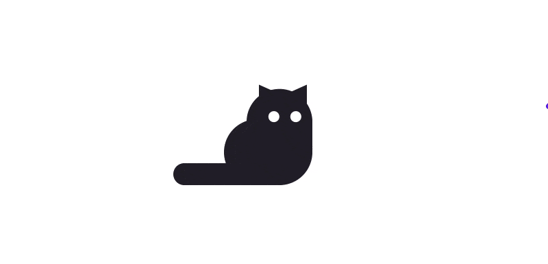

<h2> Hi, I'm Hugo Whoo! 👋</h2>


###  A little more about me...  

```javascript
const Hugo = {
  pronouns: "He" | "Him",
  code: [Javascript, HTML, CSS, C#, Aps.net],
  tools: [Vue, Vuex, React, Redux, Node, Webpack, Git, Antd, Miniprogram, VSCode]
}
```

<em style="font-size:12px;">普文二奶爸・前端攻城獅・擁抱開源・推崇極簡・Apple Fans・痴迷健身房・夢想紋花臂・目標遊世界 :)</em>

---

<!--
[](https://www.huzizi.com/)
[](https://www.weibo.com/cojis/)
[](https://www.instagram.com/jirouzizi/)
[](https://www.twitter.com/jirouzizi/)
-->
<!--
<p align="center">
 <a href="https://weibo.com/cojis"></a>
 <a href="https://instagram.com/jirouzizi"></a>
 <a href="https://twitter.com/jirouzizi"></a>
</p>
-->


<!--
- 🔭 I’m currently working on ...
- 🌱 I’m currently learning ...
- 👯 I’m looking to collaborate on ...
- 🤔 I’m looking for help with ...
- 💬 Ask me about ...
- 📫 How to reach me: ...
- 😄 Pronouns: ...
- ⚡ Fun fact: ...
-->
